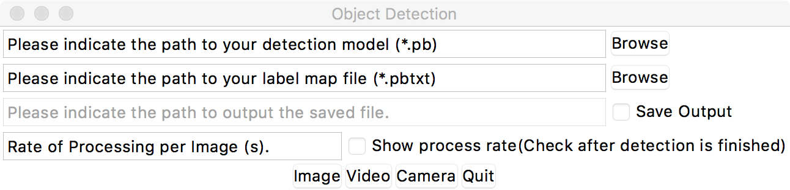
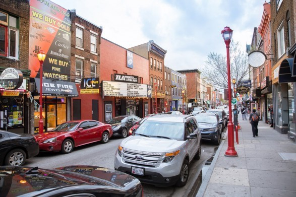
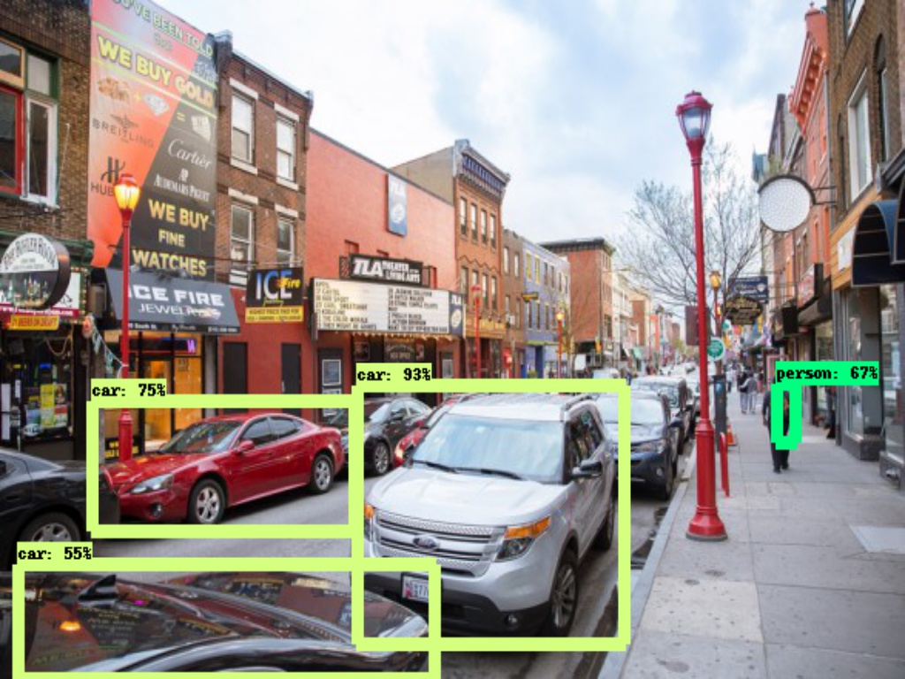

# Object Detection
Simply run the following bash code at the directory(../uwseds-group-zero/objectdetection)
```sh
$ python unser_interface.py
```
The user interface will show up:


The programe is able to process three different type of media data -- images, videos, camera stream

# Buttom specification
| Buttom | Specification |
| ------ | ------ |
| Browse | Select the model or label map data |
| Save Output | Tick to save the output file |
| Show process rate | Tick to show the processing speed |
| Image | Load the image that want to process |
| Video | Load the videl that want to process |
| Camera | Load the camera stream that want to process |
| Quit | End the program |

# Example
Here we show a processed result of a example image. The origin image:

The process result:
